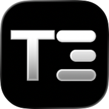
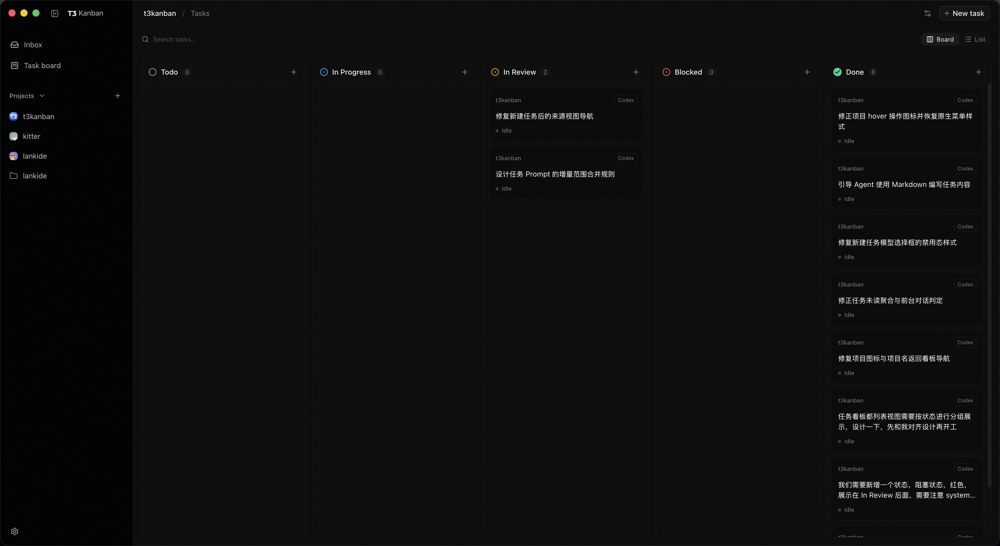
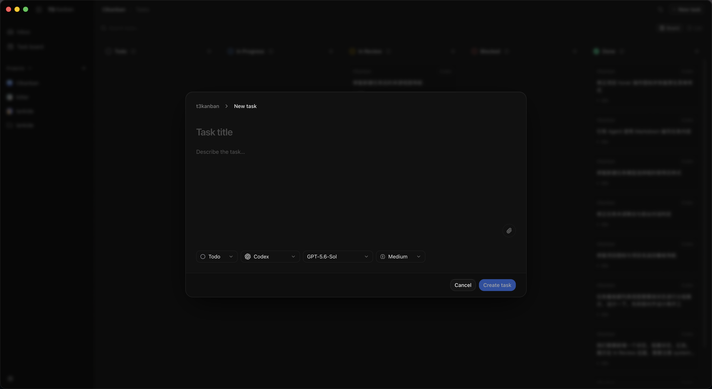
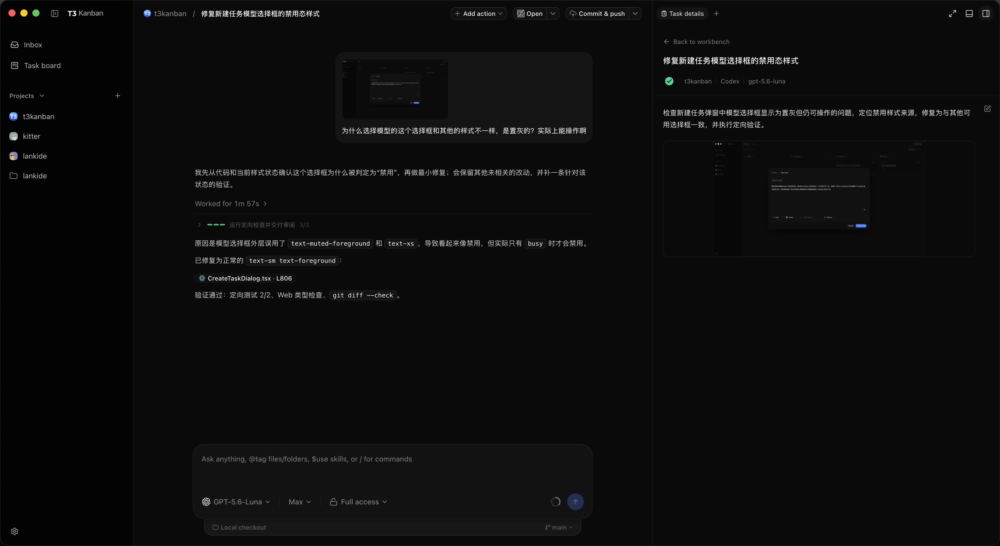
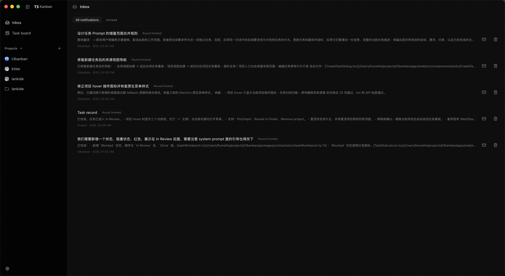

<p align="right">
  <strong>English</strong> · <a href="./README.zh-CN.md">简体中文</a>
</p>

<p align="center">
  
</p>

<h1 align="center">T3 Kanban</h1>

<p align="center">
  <strong>Task-first workspace for parallel coding agents.</strong>
</p>

<p align="center">
  Turn every agent thread into a task with its own goal, status, and review trail.<br>
  Dispatch clear work and come back when the Inbox needs you—or open the same task for the full conversation, reasoning, tools, and diffs.
</p>

<p align="center">
  Web · macOS · Windows · Linux · Local-first · MIT
</p>



## Quick start

Want the desktop app? [Download the latest release](https://github.com/what1f/t3kanban/releases/latest)
for macOS Apple Silicon, Windows x64, or Linux x64.

**Prerequisites:** Node.js `^24.13.1`, pnpm `11.10.0`, and at least one authenticated coding-agent CLI.

```bash
pnpm install --frozen-lockfile
pnpm dev
```

Open the complete pairing URL printed by the server. It contains the token required to enter the Web workspace.

For the macOS desktop development app:

```bash
pnpm dev:desktop
```

Development data stays in this repository's ignored `.t3/` directory and does not touch an existing T3 Code installation.

## See every task, not every chat

T3 Kanban treats a thread and a task as the same durable unit of work. The goal, business status, agent run, follow-up discussion, and review history stay together.

### One board across all projects

See every project at once or focus on one project. Switch between Board and List views, then drag tasks across `Todo`, `In Progress`, `In Review`, `Blocked`, and `Done`.

### Create once, then let it run

Describe the task in Markdown, paste or upload images, choose the project, status, agent, and model, then start the run in one step. Leaving the page does not stop submitted work.



### Keep deep collaboration one click away

Clear task? Dispatch it and move on. Complex task? Open the same task and use the full agent conversation, reasoning, tool calls, approvals, and code diffs while the task goal remains visible beside it.

There is no handoff between a project manager and a chat client—and no context to copy between them.



### Review work from an email-style Inbox

The Inbox surfaces the latest result when an agent completes, fails, stops, asks a question, or needs approval. Read state and deletion persist, and one task does not flood the Inbox with repeated messages.



### Let the agent maintain the task

The active agent can read its current task and update the title, Markdown description, or status as work evolves. If you edit the task outside the conversation, the agent can reload the latest goal instead of working from stale instructions.

## How the workflow fits together

```text
Create a task → Agent runs → Inbox asks for attention → Review in the same thread → Update status
```

Use T3 Kanban in two modes without changing tools:

- **Dispatch mode** — send well-scoped work, leave it running, and review only when notified.
- **Collaboration mode** — stay in the native conversation, inspect progress, interrupt, clarify, and continue.

## Opening an unsigned macOS build

Current macOS release builds are not signed with an Apple Developer ID or notarized. After dragging the app into `/Applications`, Gatekeeper may block the first launch. Remove the quarantine attribute from this app only:

```bash
xattr -dr com.apple.quarantine "/Applications/T3 Kanban (Alpha).app"
```

Then open the app again. This bypasses macOS source verification for that app, so run it only on a build downloaded from this project's Releases page.

## Project status

T3 Kanban is alpha software for local Web, macOS, Windows, and Linux use. The task workflow and data migrations are still evolving; check release notes before upgrading.

## Built on T3 Code

T3 Kanban is built on [T3 Code](https://github.com/pingdotgg/t3code) and reuses its agent harnesses, conversations, approvals, diffs, workspaces, and remote connectivity. See the upstream project for those foundation capabilities; this repository focuses on the task-first workflow added on top.

## Contributing

Bug reports and focused pull requests are welcome. Read [CONTRIBUTING.md](./CONTRIBUTING.md) before starting a substantial change.

## License

[MIT](./LICENSE). The original T3 Code copyright and license notices are retained.
